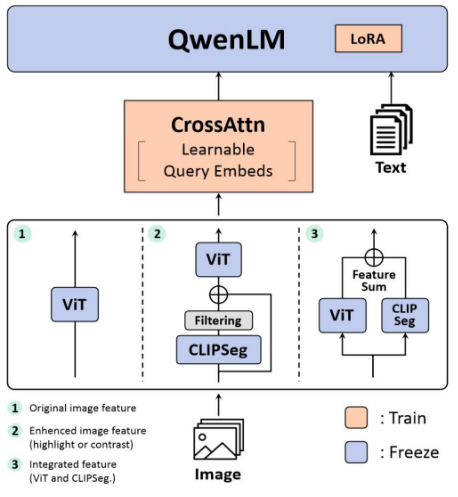

## CVPR VizWiz Visual Question Answering 
# Integrating Query-aware Segmentation and Cross Attention for Robust VQA 

  

- paper : https://arxiv.org/pdf/2407.12055

## Dataset and test code
  - Download dataset : https://vizwiz.org/tasks-and-datasets/vqa/
  - You also download test/validation code at this link. 

## Load model directly
  - We use Qwen-VL-Chat as a backbone model. 
  - You can use the Qwen-VL-Chat as follows.
<pre>
<code>
  from transformers import AutoModelForCausalLM
  model = AutoModelForCausalLM.from_pretrained("Qwen/Qwen-VL-Chat", trust_remote_code=True)
</code>
</pre>
  - Then, replace modeling_qwen.py, qwen_generation_utils.py, visual.py files in Qwen-VL-Chat to the files in Qwen-VL-Chat_core
